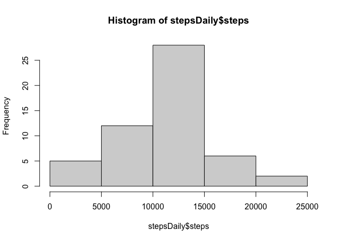
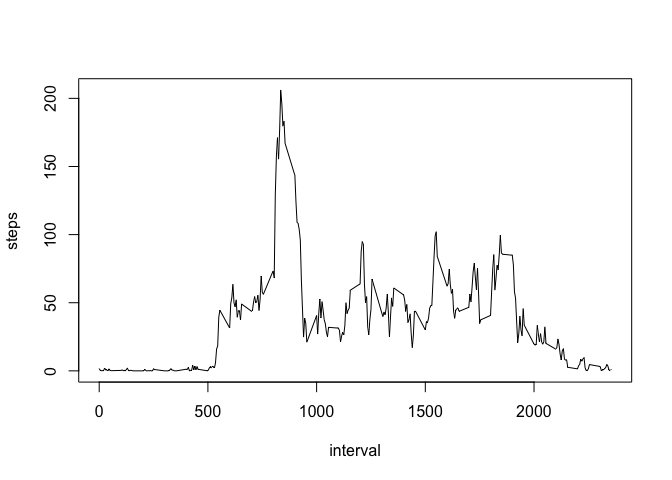
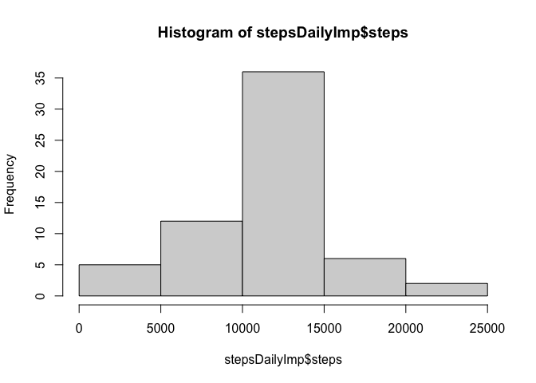
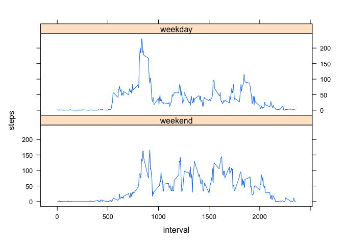

## Loading and preprocessing the data


## What is mean total number of steps taken per day?

```r
stepsDaily <- aggregate(steps~date,data=dat,sum)
hist(stepsDaily$steps)
```

<!-- -->

```r
meanSteps <- mean(stepsDaily$steps)
medianSteps <- median(stepsDaily$steps)
```
The mean total number of steps taken per day is 1.0766189\times 10^{4}.
The median total number of steps taken per day is 10765.


## What is the average daily activity pattern?

```r
stepsInterval <- aggregate(steps~interval,data=dat,mean)
plot(stepsInterval,type="l")
```

<!-- -->

```r
maxIntrvl <- stepsInterval[which.max(stepsInterval$steps),1]
```
The average daily maximum occurs at 835.


## Imputing missing values

The total number of NAs is 2304.


```r
newDat <- dat
for (i in 1:nrow(dat)){
  if (is.na(dat$steps[i])) {
    newDat$steps[i] <- stepsInterval$steps[which(stepsInterval$interval==dat$interval[i])]
  }
}
stepsDailyImp <- aggregate(steps~date,data=newDat,sum)
hist(stepsDailyImp$steps)
```

<!-- -->

```r
meanSteps <- mean(stepsDailyImp$steps)
medianSteps <- median(stepsDailyImp$steps)
```
The mean total number of steps taken per day is 1.0766189\times 10^{4}.
The median total number of steps taken per day is 1.0766189\times 10^{4}.


## Are there differences in activity patterns between weekdays and weekends?

```r
library(lattice)
wkendVector <- c("Sat","Sun")
newDat$day <- factor((weekdays(newDat$date,abbreviate = TRUE) %in% wkendVector),
                     levels=c(TRUE,FALSE), labels=c('weekend', 'weekday'))
stepsWkend <- aggregate(steps~interval+day,data=newDat,mean)
xyplot(steps~interval|day,data=stepsWkend,layout=c(1,2),type="l")
```

<!-- -->
